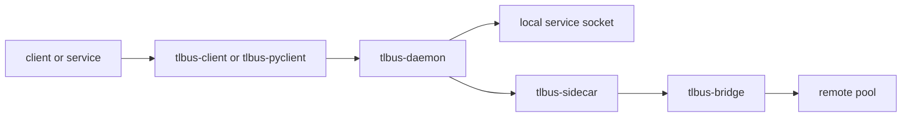

# TL-Bus


<p align="center">
  
</p>

> A Rust message bus for microservices with explicit routing, lineage, and federation.

TL-Bus is a core workspace for message-driven systems. It keeps message flow visible and inspectable through explicit envelopes, manifests, and plugin stages.

## Scope boundary

This repository is the TL-Bus core only.
It contains bus components, plugins, and base clients/workers.
It does not include application stacks.

## Project focus

- explicit envelopes with stable metadata
- `txn_id` propagation across the full message path
- service manifests with capabilities and modes
- local delivery through Unix sockets
- cross-pool delivery through bridge and sidecar
- plugin pipeline for lineage, auth, HMAC, and protocol handling

## Main pieces

| Component | Role |
| --- | --- |
| `tlbus-core` | Core message types, frame codecs, routing helpers, plugin contracts |
| `tlbus-daemon` | Local bus daemon that validates and routes envelopes |
| `tlbus-bridge` | HTTP/2 federation bridge between pools |
| `tlbus-sidecar` | Runtime that combines daemon and bridge |
| `tlbus-send` | Thin one-shot sender CLI |
| `tlbus-client` | Base Rust client with registration/send/receive primitives |
| `tlbus-worker` | Base Rust worker wrapper built on `tlbus-client` worker runtime |
| `tlbus-pyclient` | Base Python client (`clients/pyclient/tlbus_pyclient.py`) |
| `crates/plugins/*` | Lineage, auth, HMAC, and manifest/protocol plugins |

## Architecture at a glance



## Repository layout

```text
tlbus/
|- crates/
|  |- core
|  |- daemon
|  |- bridge
|  |- sidecar
|  |- send
|  `- plugins/
|- clients/
|  |- client/
|  |- pyclient/
|  `- worker/
|- docs/
|  |- en/
|  `- it/
`- .github/workflows/
```

The docs tree follows a locale-per-branch structure inspired by FastAPI docs.

## Quick start

Run automatic checks:

```bash
cargo fmt --all --check
cargo test --workspace --all-targets
```

Inspect base CLIs:

```bash
cargo run -p tlbus-client -- --help
cargo run -p tlbus-worker -- --help
python3 clients/pyclient/tlbus_pyclient.py --help
```

## GHCR images

The repository publishes Docker images through
[.github/workflows/ghcr-images.yml](.github/workflows/ghcr-images.yml):

- `ghcr.io/<owner>/tlbusd` for the core daemon
- `ghcr.io/<owner>/tlbusnet` for federation runtime
- `ghcr.io/<owner>/tlbusnet-obs` for federation runtime with Prometheus observability enabled
- `ghcr.io/<owner>/tlbus-client` for Rust client base
- `ghcr.io/<owner>/tlbus-pyclient` for Python client base
- `ghcr.io/<owner>/tlbus-worker` for Rust worker base

Release tags are calendar-style tags such as `2026.0.1` and are pushed when the Git tag starts with `20`.
`latest` tracks the default branch.

## Base image map

| Image | Docker target | Purpose |
| --- | --- | --- |
| `tlbus-client` | `client-runtime` | Base Rust client image |
| `tlbus-pyclient` | `pyclient-runtime` | Base Python client image |
| `tlbus-worker` | `worker-runtime` | Base Rust worker image |

## Docker builds

Canonical multi-target file:
- [Dockerfile](Dockerfile)

Dedicated local build files:
- [Dockerfile-client](Dockerfile-client)
- [Dockerfile-py](Dockerfile-py)
- [Dockerfile-worker](Dockerfile-worker)
- [Dockerfile-tlbusnet-obs](Dockerfile-tlbusnet-obs)

Build from the canonical file:

```bash
docker build -f Dockerfile --target tlbusd-runtime -t tlbusd:local .
docker build -f Dockerfile --target tlbusnet-runtime -t tlbusnet:local .
docker build -f Dockerfile --target tlbusnet-runtime-obs -t tlbusnet-obs:local .
docker build -f Dockerfile --target client-runtime -t tlbus-client:local .
docker build -f Dockerfile --target pyclient-runtime -t tlbus-pyclient:local .
docker build -f Dockerfile --target worker-runtime -t tlbus-worker:local .
```

Build from dedicated files:

```bash
docker build -f Dockerfile-client -t tlbus-client:local .
docker build -f Dockerfile-py -t tlbus-pyclient:local .
docker build -f Dockerfile-worker -t tlbus-worker:local .
docker build -f Dockerfile-tlbusnet-obs -t tlbusnet-obs:local .
```

## Logging contract

Base clients and workers emit operational logs with explicit event names:

- `event=register`
- `event=send`
- `event=recv`
- `event=reply`
- `event=drop` (when applicable)

`tlbus-worker` keeps only argument parsing and payload handler logic.
Worker register/receive/reply runtime is implemented in `tlbus-client`.

Log fields follow the same trace model used by TL-Bus message flow:

- `txn_id`
- `from`
- `to`
- `reply_to`
- `service`

## Observability

Prometheus metrics are provided by the `observability` plugin.

```bash
export TLBUS_PLUGINS="lineage,auth,protocol,observability"
export TLB_METRICS_ADDR="127.0.0.1:9090"
curl -sS http://127.0.0.1:9090/metrics
```

`tlbusnet-runtime-obs` and `Dockerfile-tlbusnet-obs` enable the plugin and bind `0.0.0.0:9090`.

## Documentation

- English docs: [docs/en/docs/index.md](docs/en/docs/index.md)
- Italian docs: [docs/it/docs/index.md](docs/it/docs/index.md)
- AI guide for agents: [READMEAI.md](READMEAI.md)

## Notes

- TL-Bus keeps `txn_id` and `reply_to` explicit at bus level.
- Service discovery is manifest-driven.
- Repository license is MIT.

## Trademark

TL-Bus trademark and project site: [www.thinkstudio.it](https://www.thinkstudio.it)
