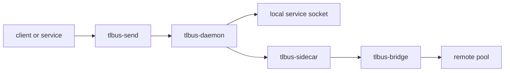

# TL-Bus


<p align="center">
  
</p>

> A Rust message bus for microservices that keeps routing, lineage, and federation explicit.

TL-Bus is organized as a Rust workspace for message-driven systems. It is built for teams that want the bus layer to stay visible and debuggable instead of disappearing behind a lot of hidden framework magic.

## Project focus

TL-Bus centers on a few things and tries to do them well:

- explicit envelopes with stable metadata
- `txn_id` propagation across the whole message path
- service manifests with capabilities and modes
- local delivery through Unix sockets
- cross-pool delivery through a bridge and sidecar pair
- a plugin pipeline for lineage, auth, HMAC, and protocol handling

## Main pieces

| Component | Role |
| --- | --- |
| `tlbus-core` | Core message types, routing helpers, plugins, and frame codecs |
| `tlbus-daemon` | Local bus daemon that validates, routes, and delivers envelopes |
| `tlbus-bridge` | HTTP/2 federation bridge between pools |
| `tlbus-sidecar` | Convenience runtime that combines daemon and bridge for a pool |
| `tlbus-send` | Small CLI for sending one envelope to the bus |
| `crates/plugins/*` | Lineage, auth, HMAC, and protocol/manifest plugins |

## Architecture at a glance



## Repository layout

```text
tlbus/
|- crates/
|  |- core
|  |- daemon
|  |- bridge
|  |- sidecar
|  |- send
|  `- plugins/
|- docs/
|  |- en/
|  `- it/
`- .github/workflows/
```

The docs tree follows the same idea as FastAPI: one locale per branch of the docs, with a landing page and focused sections underneath.

## Quick start

Run the automatic tests:

```bash
cargo test --workspace --all-targets
```

Inspect the bus sender:

```bash
cargo run -p tlbus-send -- --help
```

## GHCR Images

The repository publishes two Docker images to GitHub Container Registry through
[.github/workflows/ghcr-images.yml](/Users/archetipo/devel/microservices/projects/TL-Bus%20Project/tlbus/.github/workflows/ghcr-images.yml):

- `ghcr.io/<owner>/tlbusd` for the core daemon
- `ghcr.io/<owner>/tlbusnet` for the federation layer

Release tags are calendar-style tags such as `2026.0.1` and are pushed when the Git tag starts with `20`.
`latest` still tracks the default branch.

The images are built from [Dockerfile.ghcr](/Users/archetipo/devel/microservices/projects/TL-Bus%20Project/tlbus/Dockerfile.ghcr).

## Documentation

- English docs: [docs/en/docs/index.md](docs/en/docs/index.md)
- Italian docs: [docs/it/docs/index.md](docs/it/docs/index.md)
- AI guide for agents: [READMEAI.md](READMEAI.md)

## Notes

- TL-Bus keeps `txn_id` and `reply_to` explicit in the envelope model.
- Service discovery is manifest-driven, not hard-coded.
- The repository license is MIT.
- Demo stacks live in the sibling `examples/` folder of the project workspace.

## Author

Alessio Gerace 
