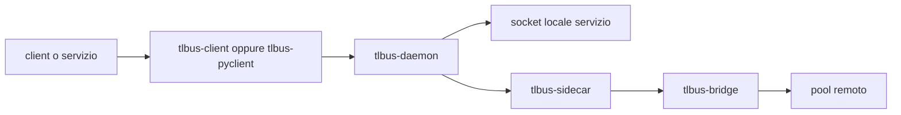

# TL-Bus


<p align="center">
  
</p>

> Bus messaggi in Rust per microservizi, con routing, lineage e federation espliciti.

TL-Bus e` un workspace core per sistemi message-driven. Mantiene il flusso dei messaggi visibile tramite envelope, manifest e pipeline plugin.

## Confine del repository

Questo repository contiene solo il core TL-Bus.
Include componenti bus, plugin e client/worker base.
Non include stack applicativi.

## Focus del progetto

- envelope espliciti con metadata stabili
- propagazione di `txn_id` lungo l'intero percorso del messaggio
- service manifest con capabilities e modes
- delivery locale tramite Unix socket
- delivery cross-pool tramite bridge e sidecar
- pipeline plugin per lineage, auth, HMAC e protocol handling

## Componenti principali

| Componente | Ruolo |
| --- | --- |
| `tlbus-core` | Tipi core dei messaggi, codec frame, helper di routing, contratti plugin |
| `tlbus-daemon` | Daemon locale che valida e instrada gli envelope |
| `tlbus-bridge` | Bridge HTTP/2 per la federation tra pool |
| `tlbus-sidecar` | Runtime che combina daemon e bridge |
| `tlbus-send` | CLI minimale per inviare un envelope singolo |
| `tlbus-client` | Client base Rust con primitive register/send/receive |
| `tlbus-worker` | Wrapper worker Rust base costruito sul runtime worker di `tlbus-client` |
| `tlbus-pyclient` | Client base Python (`clients/pyclient/tlbus_pyclient.py`) |
| `crates/plugins/*` | Plugin lineage, auth, HMAC e manifest/protocol |

## Architettura in breve



## Struttura repo

```text
tlbus/
|- crates/
|  |- core
|  |- daemon
|  |- bridge
|  |- sidecar
|  |- send
|  `- plugins/
|- clients/
|  |- client/
|  |- pyclient/
|  `- worker/
|- docs/
|  |- en/
|  `- it/
`- .github/workflows/
```

La documentazione segue una struttura per lingua, ispirata al modello docs di FastAPI.

## Quick start

Esegui i controlli automatici:

```bash
cargo fmt --all --check
cargo test --workspace --all-targets
```

Controlla le CLI base:

```bash
cargo run -p tlbus-client -- --help
cargo run -p tlbus-worker -- --help
python3 clients/pyclient/tlbus_pyclient.py --help
```

## Immagini GHCR

Il repository pubblica immagini Docker tramite
[.github/workflows/ghcr-images.yml](.github/workflows/ghcr-images.yml):

- `ghcr.io/<owner>/tlbusd` per il daemon core
- `ghcr.io/<owner>/tlbusnet` per il runtime di federation
- `ghcr.io/<owner>/tlbusnet-obs` per il runtime di federation con observability Prometheus abilitata
- `ghcr.io/<owner>/tlbus-client` per il client base Rust
- `ghcr.io/<owner>/tlbus-pyclient` per il client base Python
- `ghcr.io/<owner>/tlbus-worker` per il worker base Rust

I tag release seguono lo stile calendario (`2026.0.1`) e vengono pubblicati quando il tag Git inizia con `20`.
`latest` segue il branch di default.

## Mappa immagini base

| Immagine | Target Docker | Scopo |
| --- | --- | --- |
| `tlbus-client` | `client-runtime` | Immagine base client Rust |
| `tlbus-pyclient` | `pyclient-runtime` | Immagine base client Python |
| `tlbus-worker` | `worker-runtime` | Immagine base worker Rust |

## Build Docker

File canonico multi-target:
- [Dockerfile](Dockerfile)

File dedicati per build locale:
- [Dockerfile-client](Dockerfile-client)
- [Dockerfile-py](Dockerfile-py)
- [Dockerfile-worker](Dockerfile-worker)
- [Dockerfile-tlbusnet-obs](Dockerfile-tlbusnet-obs)

Build dal file canonico:

```bash
docker build -f Dockerfile --target tlbusd-runtime -t tlbusd:local .
docker build -f Dockerfile --target tlbusnet-runtime -t tlbusnet:local .
docker build -f Dockerfile --target tlbusnet-runtime-obs -t tlbusnet-obs:local .
docker build -f Dockerfile --target client-runtime -t tlbus-client:local .
docker build -f Dockerfile --target pyclient-runtime -t tlbus-pyclient:local .
docker build -f Dockerfile --target worker-runtime -t tlbus-worker:local .
```

Build dai file dedicati:

```bash
docker build -f Dockerfile-client -t tlbus-client:local .
docker build -f Dockerfile-py -t tlbus-pyclient:local .
docker build -f Dockerfile-worker -t tlbus-worker:local .
docker build -f Dockerfile-tlbusnet-obs -t tlbusnet-obs:local .
```

## Contratto log

I client e worker base emettono log operativi con eventi espliciti:

- `event=register`
- `event=send`
- `event=recv`
- `event=reply`
- `event=drop` (quando applicabile)

`tlbus-worker` mantiene solo parsing argomenti e logica handler payload.
Il runtime worker (register/receive/reply) e` implementato in `tlbus-client`.

I campi log seguono il modello trace del flusso TL-Bus:

- `txn_id`
- `from`
- `to`
- `reply_to`
- `service`

## Observability

Le metriche Prometheus sono fornite dal plugin `observability`.

```bash
export TLBUS_PLUGINS="lineage,auth,protocol,observability"
export TLB_METRICS_ADDR="127.0.0.1:9090"
curl -sS http://127.0.0.1:9090/metrics
```

`tlbusnet-runtime-obs` e `Dockerfile-tlbusnet-obs` abilitano il plugin e bindano `0.0.0.0:9090`.

## Documentazione

- Docs inglese: [docs/en/docs/index.md](docs/en/docs/index.md)
- Docs italiana: [docs/it/docs/index.md](docs/it/docs/index.md)
- Guida AI per agenti: [READMEAI.md](READMEAI.md)

## Note

- TL-Bus mantiene `txn_id` e `reply_to` espliciti a livello bus.
- La service discovery e` guidata dai manifest.
- La licenza del repository e` MIT.

## Trademark

TL-Bus trademark e project site: [www.thinkstudio.it](https://www.thinkstudio.it)
