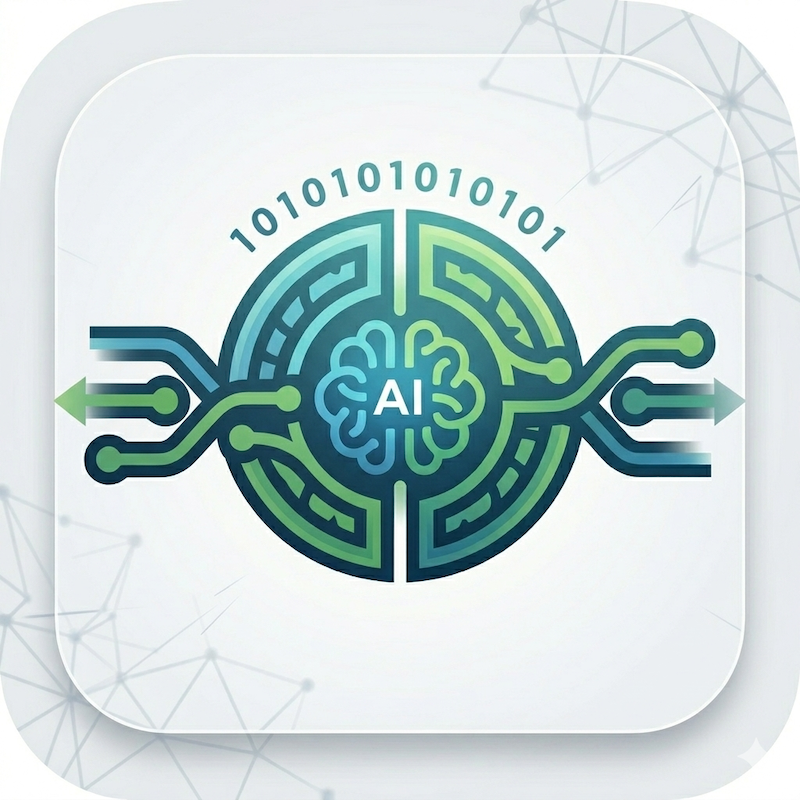
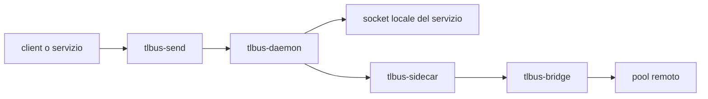

# TL-Bus


<p align="center">
  
</p>

> Un bus messaggi in Rust per microservizi, con routing, lineage e federation tenuti espliciti.

TL-Bus e` organizzato come workspace Rust per sistemi message-driven. E` pensato per team che vogliono il bus visibile e facile da debuggare, invece di nasconderlo dentro un framework troppo opaco.

## Focus del progetto

TL-Bus punta su poche cose, fatte bene:

- envelope espliciti con metadata stabili
- propagazione di `txn_id` lungo tutto il percorso del messaggio
- service manifest con capabilities e modes
- delivery locale tramite Unix socket
- delivery tra pool tramite bridge e sidecar
- pipeline di plugin per lineage, auth, HMAC e protocol handling
- demo ripetibili ed esempi facili da testare

## Componenti principali

| Componente | Ruolo |
| --- | --- |
| `tlbus-core` | Tipi core dei messaggi, routing, plugin e codec dei frame |
| `tlbus-daemon` | Daemon locale che valida, instrada e consegna gli envelope |
| `tlbus-bridge` | Bridge HTTP/2 per la federation tra pool |
| `tlbus-sidecar` | Runtime comodo che unisce daemon e bridge per un pool |
| `tlbus-send` | CLI piccola per inviare un singolo envelope al bus |
| `crates/plugins/*` | Plugin di lineage, auth, HMAC e protocol/manifest |
| `examples/*` | Demo stack ed esempi orientati all'integrazione |

## Architettura in breve



## Struttura repo

```text
tlbus/
|- crates/
|  |- core
|  |- daemon
|  |- bridge
|  |- sidecar
|  |- send
|  `- plugins/
|- docs/
|  |- en/
|  `- it/
|- examples/
`- .github/workflows/
```

La docs segue l'idea di FastAPI: una cartella per lingua, una landing page iniziale e sezioni dedicate sotto.

## Quick start

Esegui i test automatici:

```bash
cargo test --workspace --all-targets
```

Guarda l'help del sender:

```bash
cargo run -p tlbus-send -- --help
```

## Immagini GHCR

Il repository pubblica due immagini Docker su GitHub Container Registry tramite
[.github/workflows/ghcr-images.yml](/Users/archetipo/devel/microservices/projects/TL-Bus%20Project/tlbus/.github/workflows/ghcr-images.yml):

- `ghcr.io/<owner>/tlbusd` per il daemon core
- `ghcr.io/<owner>/tlbusnet` per il layer di federazione

I tag di release seguono uno stile calendario come `2026.0.1` e vengono pubblicati quando il tag Git inizia con `20`.
`latest` continua a seguire il branch di default.

Le immagini sono costruite da [Dockerfile.ghcr](/Users/archetipo/devel/microservices/projects/TL-Bus%20Project/tlbus/Dockerfile.ghcr).

## Documentazione

- Docs in inglese: [docs/en/docs/index.md](docs/en/docs/index.md)
- Docs in italiano: [docs/it/docs/index.md](docs/it/docs/index.md)
- Guida AI per agenti: [READMEAI.md](READMEAI.md)

## Note

- TL-Bus mantiene `txn_id` e `reply_to` espliciti nel modello envelope.
- La discovery dei servizi e` guidata dai manifest, non hardcoded.
- La licenza del repository e` MIT.
- Le demo stack vivono nella cartella `examples/` sorella del workspace.

## Trademark

TL-Bus trademark e project site: [www.thinkstudio.it](https://www.thinkstudio.it)
